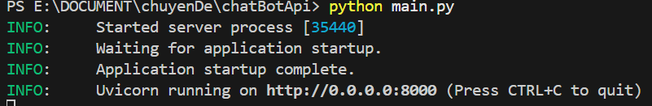

# Hướng dẫn khởi động ChatBot API

1. Cài đặt Python (nếu đã cài thì bỏ qua bước này).
2. Mở terminal trong thư mục chứa file `main.py` và `requirements.txt`.
3. Chạy lệnh: `pip install -r requirements.txt`,đợi quá trình cài đặt các thư viện hoàn tắt.
4. Chạy Backend trong Xampp trước
5. Chạy api Chatbot: gõ `python main.py` trong terminal.
6. Đợi màn hình hiện chữ `Uvicorn running on http://0.0.0.0:8000` là ok.
   
